# Bot de Discord en Python: Mundial
## Link de la API: API LINK
cómo funciona y cuáles son sus
comandos. Que necesitan los usuarios para correr el bot y como instalar esas
dependencias, programas, etc.

# Este bot tiene que tener 6 comandos:

## 1. Comando de ayuda:
/!ayuda Muestra la información de los diferentes comandos presentes en el bot.
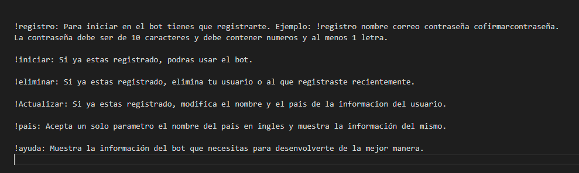

## 2. Comando de registro:
/!registro Registra el usuario en la API y en nuestra base de datos.
La contraseña tiene que tener 10 caracteres como minimo y al menos una letra, sin caracteres especiales incluyendo la ñ, de lo contrario le aparecera "datos incompletos". A continuacion ejemplo de lo escrito:
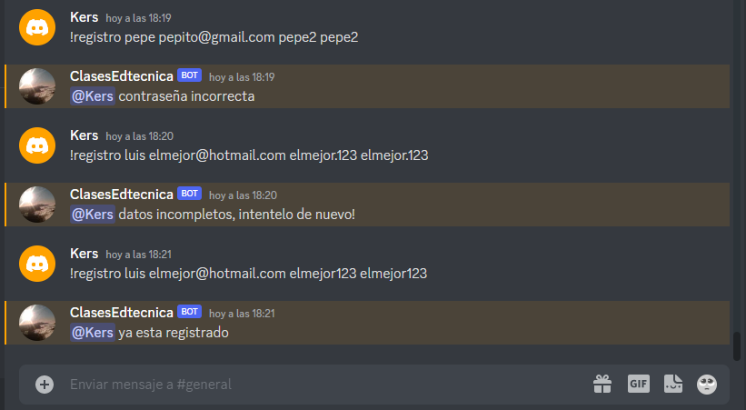

Si escribe el correo erroneo o incompleto le arrojara el siguente error:
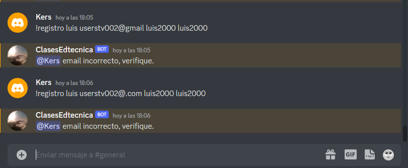

En caso de tener todos los datos correctos le saldra lo siguiente:
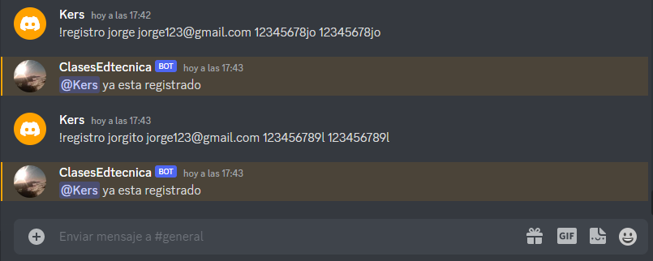

## 3. Comando de iniciar sesión:
/!iniciar Para poder utilizar la API el usuario necesita iniciar sesión. De lo contrario si utiliza algun otro comando le va a solicitar iniciar.
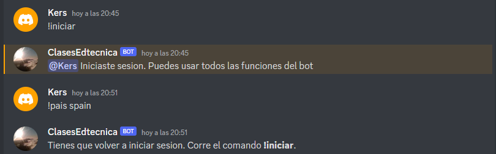

## 4. Comando de eliminar:
/!eliminar Para que el usuario pueda hacer uso  de ese comando, antes tienes que haberse registrado. Eliminara su usuario o en efecto el usuario que haya agregado recientemente.

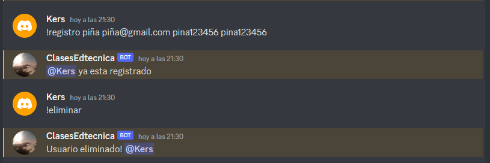

## 5. Comando de Actualizar: 
/!actualizar Se hace uso de este comando cuando ya se ha registrado un usuario con un pais determinado. Este permite actualizar dicha informacion en la base de datos.
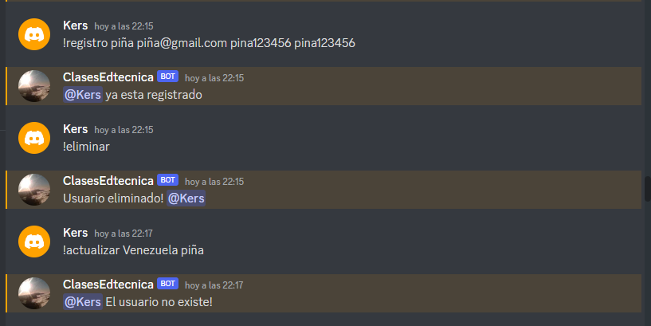
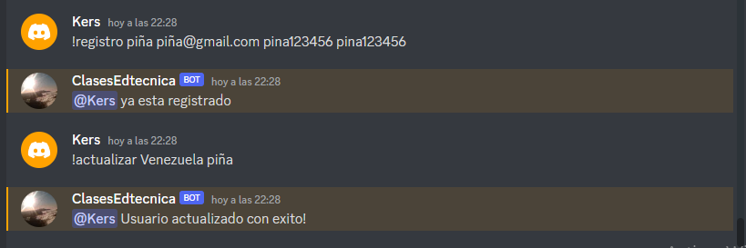

## 6. Comando de Pais:
/!pais colombia El comando de pais es utilizado seguido con el nombre del pais y sirve para obtener la informacion del pais que quieras. Aqui puedes ver algunas de sus caracteristicas, lo puedes escribir tanto en español como en ingles.
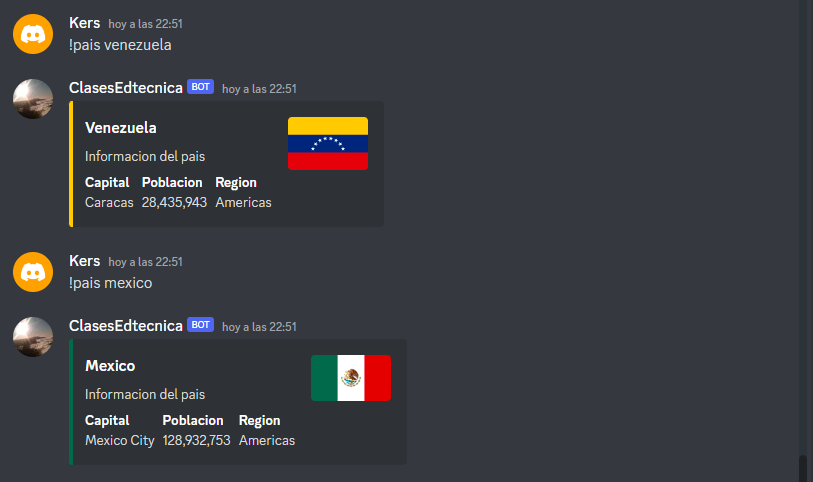
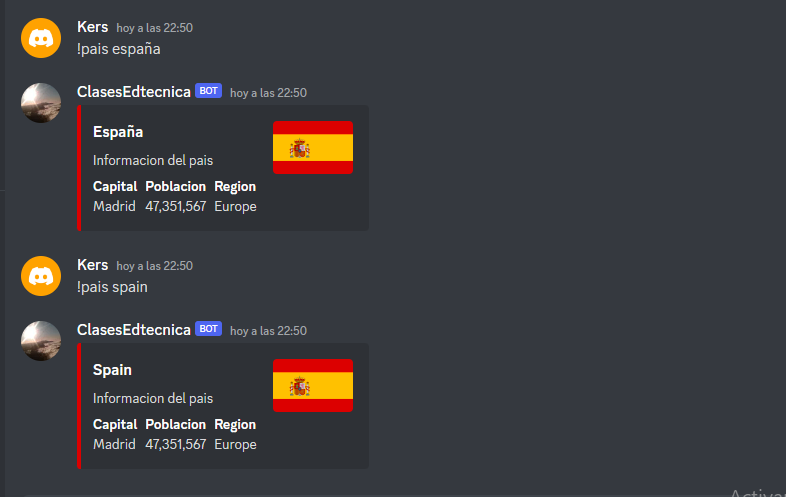

Este comando tiene autocompletacion, es decir, no necesariamente tienes que escribir el nombre completo del pais, si no hay ninguno que coincida con sus primeras letras este te arrojara el que mas se le parezca. 
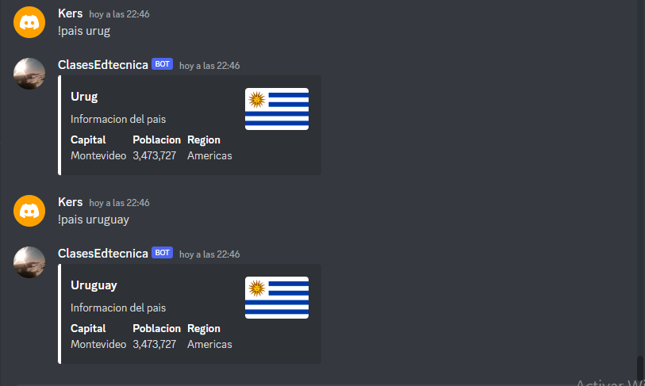

En caso de que no hayas escrito un pais correcto, te mostrara un mensaje.
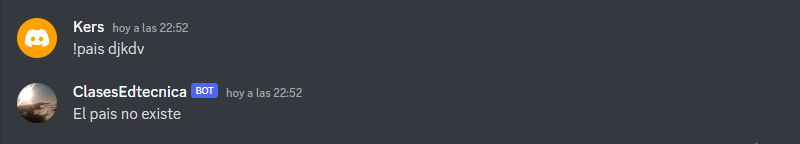

## 7. Comando equipo:
/!equipo Muestra la información de un equipo:
IMG
En caso de que el equipo no exista tenemos que indicárselo al usuario
IMG EJEMPLO VZLA

## 8. Comando partidos:
/!partidos Se le muestra los siguientes tres partidos con la fecha, hora local y goles:

## Herramientas necesarias para ejecutar el bot
ventanas 10
1- Descarga NodeJS desde la web oficial: https://nodejs.org/es/download/ .
2- Descargue Git para Windows desde el sitio web oficial: https://gitforwindows.org/ . Siga los pasos para instalar git.

## Configuración de bots
### Configuración de una cuenta de bot de Discord

1- Navegue al sitio web del portal para desarrolladores de Discord e inicie sesión con su cuenta principal de Discord: https://discord.com/developers/applications .

2- Haga clic en el botón Nueva aplicación en la parte superior derecha:

3- Asigne un nombre a su bot y haga clic en Crear.

4- Vaya a la sección Bot en el menú del lado izquierdo:

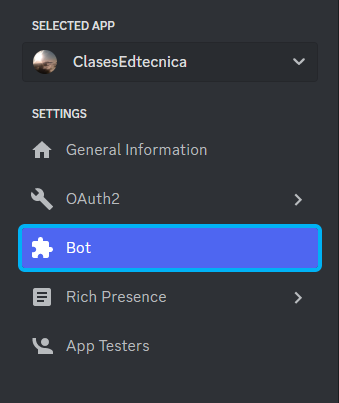

5- En la sección de bot, haga clic en el botón Agregar bot:

6- Asigne un nombre a su bot y proceda a restablecer el token del bot:

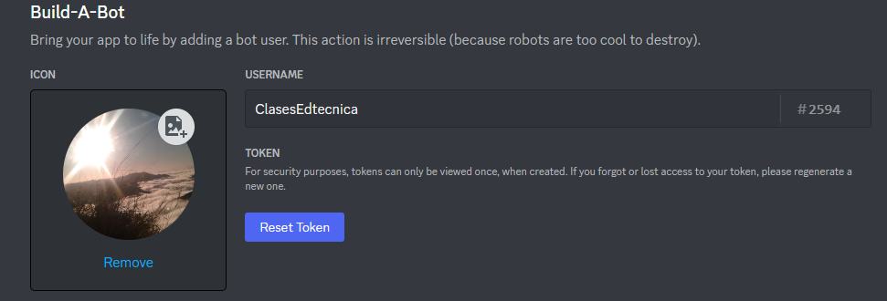

7- Tan pronto como haga clic en restablecer token, debe copiar el nuevo token generado y guardarlo por ahora en algun sitio no publico.

## Crea la URL para Invitar a tu Bot

1- Vaya a la página OAuth2 desde el menú de la izquierda y vas a ingresar en URL Generador:

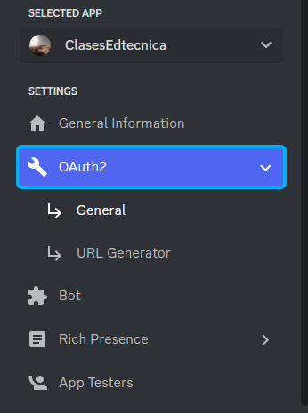

2- Estando ahi seleccione los ámbitos bot y application.commands. El primero otorga privilegios al bot de la cuenta y el segundo permite comandos.

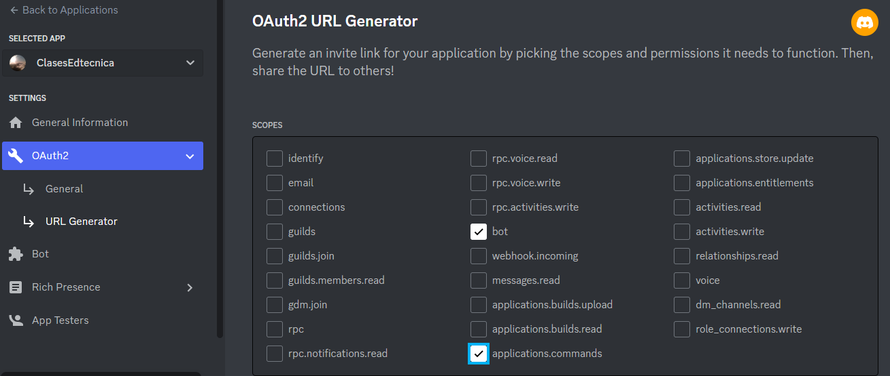

3- Seleccione los permisos que necesita el bot para ejecutarse, como se muestra a continuación, para a fines de este bot solo necesitamos uno:

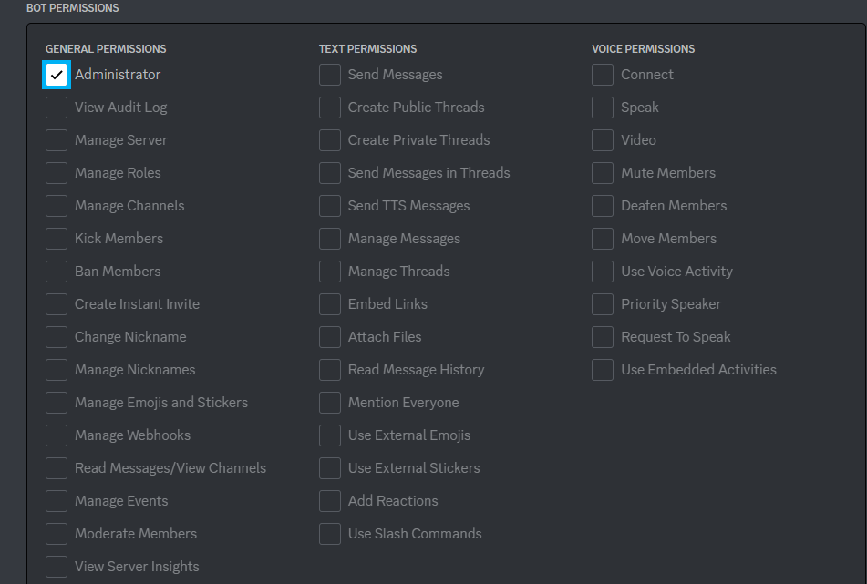

4- Copie la URL inferior y péguela en el navegador de su preferencia. Esto lo llevará a un menú de Discord para seleccionar a qué servidor agregar su bot. Solo se mostrarán los servidores en los que tiene permisos para agregar bots. Seleccione su servidor y confirme.

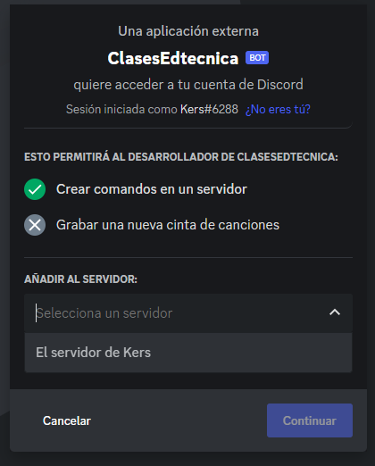

Ahora el bot está en tu servidor de discordia pero por el momento no funciona. Necesitamos configurar el código para el bot primero.

## Configurando el código para el Bot
### Llenando el env
Primero, deberá completar su archivo env. El bot viene con un archivo example.env. Renombrar a env. Deberá agregar su token de bot.

### Instala las dependencias necesarias
En su terminal donde se descargó su bot, ejecute el siguiente comando:

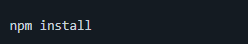

Si el proceso falla, vuelve a intentarlo. Esto instalará todas las dependencias necesarias para ejecutar el bot.

# Ejecutar el bot
Ahora que tenemos todo listo, ejecute en su terminal el siguiente comando para poner el bot en línea:

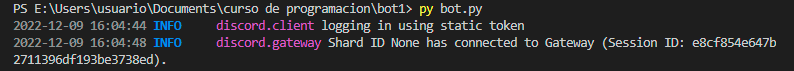

Esto iniciará el bot y ahora puede usarlo en su servidor de discord.

